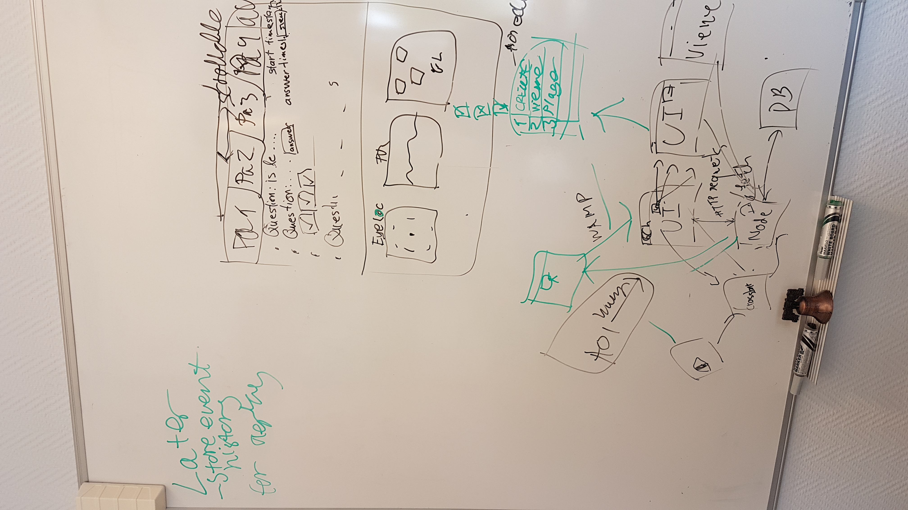

# SynOpticonLite

Dependencies:
MongoDB
NPM

Installation instructions:
In the WebEntry dir - cmd npm install
In the WebEntry/backend dir - cmd npm install

How to run:
Use the launcher.bat file.

Current Design Plan:

  

